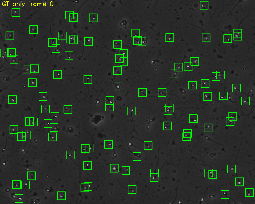
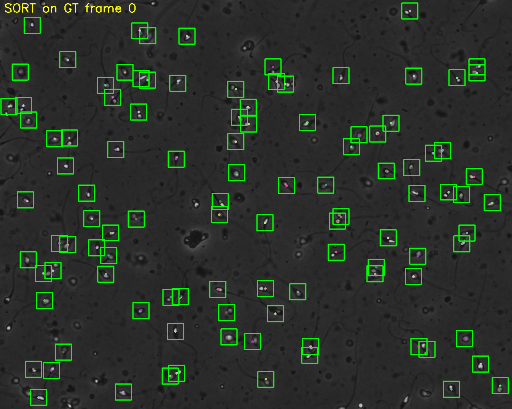
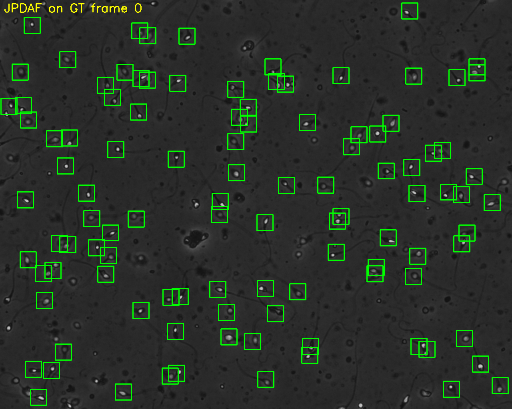

# pycasa Test — HC004 default data ile adım adım deneme

> **For the lab / in English:** [FINDINGS.md](FINDINGS.md) — the 140-case API
> coverage table and the full step-by-step evidence chain for the YOLO26 / NMS
> finding. All numbers generated from `outputs/*.json`, nothing typed by hand.

Kütüphane: https://github.com/DFL-KamLab/pycasa (docs: https://dfl-kamlab.github.io/pycasa/)

Tüm scriptler `scripts/` altında, çıktılar (`.json`, log, GIF/PNG) `outputs/` altında.
Her script `python scripts/<isim>.py` ile çalışır. IPython'da satır satır da denenebilir.

## Kurulum notları (Windows)

```bash
pip install git+https://github.com/DFL-KamLab/pycasa.git
pip install scikit-image scipy motmetrics huggingface_hub torch torchvision ultralytics matplotlib pandas imageio ipython
pip install git+https://github.com/DFL-KamLab/sort.git
```

- SORT tracker için `sort` paketi ayrıca gerekli (yukarıdaki son satır).
- YOLOv5 ilk çalışmada `ultralytics/yolov5` reposunu `C:\Users\<user>\.pycasa\yolov5` altına klonlamak ister (y/N sorar).
- **Türkçe karakterli klasör yolu sorunu:** YOLOv5 ağırlıkları çalışma klasörüne (`yolov5-weights/`) iner ve `torch.jit.load`
  "Masaüstü" gibi ASCII olmayan yollarda dosyayı açamaz. Çözüm: `PYCASA_PROJECT_ROOT` ortam değişkenini ASCII bir klasöre
  yönlendirmek, örn. `set PYCASA_PROJECT_ROOT=C:\Users\<user>\.pycasa_data`.

---

## 1) Default datayı yükleme

```python
import pycasa as pc
self = pc.io.load_default_data()
```

İlk çalışmada HuggingFace'ten HC004 alt kümesi (`~/.pycasa_data`, 903 dosya) indirilir.
Yüklenen video: `sys-casa_sub-HC004_ses-01_run-005_video.avi`, ilk 101 frame (0–100) / toplam 901, 1280x1024, 30 fps.

Otomatik ayarlanan meta parametreleri:

| Parametre | Değer | Anlamı |
|---|---|---|
| `um_per_px` | 0.24 | Bir pikselin mikrometre karşılığı (HSTLI kalibrasyonu). Piksel hızlarını µm/s'ye çevirmek için kullanılır. |
| `volume_ml` | 2.2 | HC004 ejakülat hacmi (laboratuvar ölçümü). Toplam sperm sayısı = konsantrasyon × hacim. |
| `chamber_depth_um` | 20.7 | Sayım odası derinliği (sys-casa çekim sabiti). Konsantrasyon = hücre/frame ÷ (görüntü alanı × derinlik). |

Groundtruth: 900 frame'de toplam 81 179 detection etiketi (YOLO formatı: class, cx, cy, w, h normalize).
Default datada **GT track yok**, sadece GT detection var (`get_tracks()` boş döner).

Script: `scripts/step1_load.py`

## 2) Timelapse ile sadece GT detection görselleştirme

```python
self.visualization.timelapse(video_type="original", show_detections=False, show_tracks=False, show_groundtruth=True)
```

Hiçbir detection/tracking çalıştırılmadı; yeşil (lime) kutular GT. Timelapse interaktif bir matplotlib penceresi açar
(slider, play/pause, ok tuşları, overlay toggle butonları). Repoya koymak için aynı overlay `scripts/render_gif.py` ile GIF'e render edildi:



Script: `scripts/step2_timelapse_gt.py`

## 3) YOLOv5, YOLO26 ve moving-cells detection + assessment

```python
self.detection.yolo(yolo_model="yolov5");  self.assessment.evaluate_detections()
self.detection.yolo(yolo_model="yolo26");  self.assessment.evaluate_detections()
self.detection.detect_moving_cells();      self.assessment.evaluate_detections()   # method="cv-gmg"
```

Eşleştirme: GT ile merkez mesafesi ≤ 20 px (`match_min_distance_pixel=20`). Sonuçlar (frame 0–100):

| Detector | TP | FP | FN | Precision | Recall | F1 | Değerlendirilen frame |
|---|---|---|---|---|---|---|---|
| YOLOv5 (sys-casa_yolov5s) | 7716 | 2976 | 2376 | 72.17 % | 76.46 % | **74.25 %** | 101 (0–100) |
| YOLO26 (sys-casa_yolo26s), YOLOv5'ten sonra\*\* | 9985 | 4797 | 107 | 67.55 % | 98.94 % | **80.28 %** | 101 (0–100) |
| YOLO26 (sys-casa_yolo26s), izole\*\* | 9985 | 5806 | 107 | 63.23 % | 98.94 % | **77.15 %** | 101 (0–100) |
| Moving cells (cv-gmg) | 6800 | 8069 | 1266 | 45.73 % | 84.30 % | **59.30 %** | 81 (20–100)* |

\*\* **Sıra bağımlılığı (kütüphane sorunu):** YOLO26 aynı process'te önce YOLOv5 çalıştıysa farklı sonuç veriyor.
Yukarıdaki YOLO26 satırı YOLOv5'ten sonra alındı (14 782 detection). İzole çalıştırınca: 15 791 detection,
TP=9985, FP=5806, FN=107, precision 63.23 %, recall 98.94 %, **F1 77.15 %**. TP/FN aynı, sadece düşük güvenli FP'ler değişiyor
(conf p5: 0.259 → 0.192). Aynı session'da YOLO26'yı iki kez çalıştırmak ise deterministik (aynı sonuç). Bkz. `scripts/step6_motility.py`
(izole yolo26 kullanır, 15 791 detection).
Kök neden araştırması: YOLOv5 reposunu (`~/.pycasa/yolov5`, `models.common`) sadece **import etmek** bile YOLO26 çıktısını
değiştiriyor (14 782). OpenCV thread sayısı (import sırasında 16→1 oluyor) ve `conf` eşiği eleniyor: thread'i geri alınca yine 14 782,
`conf=0.05` verince 17 609 (parametre dinleniyor). Yani yolov5 import'u torch/ultralytics tarafında sayısal sonucu etkileyen bir
global durum bırakıyor. **Çözüm:** YOLOv5 ve YOLO26'yı ayrı Python process'lerinde çalıştırın (ya da YOLO26'yı önce çalıştırın).
Kütüphane tarafında kalıcı çözüm: YOLOv5 inference'ını subprocess'te izole etmek.

\* Moving-cells yöntemi ilk 20 frame'i arka plan modeli eğitimi için kullanır (`training_frames=20`), bu yüzden 20–100 arası değerlendirilir.

Yorum: YOLO26 neredeyse hiç kaçırmıyor (recall %98.9) ama daha fazla FP üretiyor; YOLOv5 daha dengeli; arka plan çıkarımına
dayalı moving-cells hareketsiz hücreleri yakalayamadığı ve gürültü ürettiği için en düşük skoru alıyor.

Frame 0 örnekleri (kırmızı = detection, yeşil = GT): `outputs/step3_yolov5_frame0.png`, `outputs/step3_yolo26_frame0.png`, `outputs/step3_moving_cells_frame0.png`

Script: `scripts/step3_detection_assessment.py` — ham sonuçlar `outputs/step3_detection_assessment.json`, log `outputs/step3_log.txt`

## 4) Tek detection modeli kuralı (overwrite)

pycasa oturumda aynı anda **tek bir** predicted-detection seti tutar. Yeni bir detector çalıştırınca önceki sonuç silinir ve uyarı basılır:

```
Warning: Previous detection result overwritten (yolov5 -> yolo26).
Warning: Previous detection result overwritten (yolo26 -> moving_cells).
```

Bu yüzden 3. adımda her detector'dan hemen sonra `evaluate_detections()` çağrıldı ve sonuç `deepcopy` ile saklandı
(`get_assessment()` aynı dict nesnesini döndürdüğü için kopyalamazsan sonraki run üstüne yazar).
Aynı kural tracking için de geçerli: `Warning: Previous tracking result overwritten (sort -> jpdaf).`

## 5) Sadece GT üstünde SORT ve JPDAF tracking + timelapse

```python
self.tracking.sort()   # Warning: No detections found, tracking will only run on GT
self.visualization.timelapse(show_detections=False, show_groundtruth=True, show_tracks=True)
self.tracking.jpdaf()  # Warning: Previous tracking result overwritten (sort -> jpdaf)
self.visualization.timelapse(show_detections=False, show_groundtruth=True, show_tracks=True)
```

| Tracker | Track sayısı | Ortalama track uzunluğu (frame) | Hız |
|---|---|---|---|
| SORT (Bewley, GPL-3.0) | 141 | 66.63 | ~100 frame/s |
| JPDAF (Urbano et al. 2017, IEEE TMI) | 142 | 74.94 | ~10 frame/s |

Track yapısı: `get_tracks()[backend][source][track_id] = {frame_index: [x_px, y_px]}`.




Script: `scripts/step5_tracking_gt.py` (GIF), `scripts/step5_timelapse_interactive.py` (interaktif pencere)

## 6) GT+SORT ve YOLO26+SORT → kinematik ve CASA parametreleri, HSTLI ile karşılaştırma

```python
# (a) GT + SORT
s = pc.io.load_default_data(); s.tracking.sort()
s.motility.kinematic_parameters(); s.motility.casa_parameters()
# (b) YOLO26 + SORT
s = pc.io.load_default_data(); s.detection.yolo(yolo_model="yolo26"); s.tracking.sort(skip_gt=True)
s.motility.kinematic_parameters(); s.motility.casa_parameters()
```

Kinematik parametreler (ortalama ± std, pencere = 30 nokta ≈ 1 s, SCA benzeri ayarlar):

| Pipeline | Track | VCL (µm/s) | VSL (µm/s) | VAP (µm/s) | LIN | ALH (µm) | WOB | STR | MAD (°) |
|---|---|---|---|---|---|---|---|---|---|
| GT + SORT | 111 | 28.31 ± 11.10 | 17.80 ± 9.86 | 19.64 ± 9.69 | 0.58 | 1.06 | 0.66 | 0.83 | 43.3 |
| YOLO26 + SORT | 154 | 22.20 ± 14.77 | 14.93 ± 10.96 | 16.25 ± 11.33 | 0.58 | 0.85 | 0.67 | 0.82 | 39.0 |

CASA parametreleri (eşikler SCA'ya göre: VCL, immotile < 19, rapid ≥ 29 µm/s, progressive STR ≥ 0.68) ve
HSTLI `sys-casa_casaMotilityReports.csv` → satır `sys-casa_sub-HC004`, **Unwashed Samples** sütunları:

| Kaynak | %Rapid | %Slow | %Non-prog | %Immotile | Konsantrasyon (10⁶/mL) | Toplam sayı (10⁶) |
|---|---|---|---|---|---|---|
| **HSTLI referans (HC004, unwashed)** | **42** | **23** | **9** | **26** | **69** | **151.8** |
| GT + SORT | 49.55 ± 4.75 | 27.03 ± 4.22 | 2.70 ± 1.54 | 20.72 ± 3.85 | 59.52 ± 0.34 | 130.95 |
| YOLO26 + SORT | 37.01 ± 3.89 | 20.78 ± 3.27 | 1.95 ± 1.11 | 40.26 ± 3.95 | 85.39 ± 0.60 | 187.86 |

Yorum:
- GT+SORT referansa yakın: rapid/slow biraz yüksek, immotile biraz düşük, non-progressive belirgin düşük (2.7 vs 9).
  Konsantrasyon %14 düşük (59.5 vs 69): sadece 101 frame (3.4 s) ve tek video kesiti kullanıldı, referans tüm çekimden.
- YOLO26+SORT: FP'ler (precision %67.5) kısa/sahte track üretip immotile oranını şişiriyor (%40 vs %26) ve
  konsantrasyonu yükseltiyor (85 vs 69). Detection kalitesi doğrudan CASA sonucuna yansıyor.
- Uyarı: 30 fps, önerilen 50 fps'nin altında; VCL ve ALH eğri yolun az örneklenmesi yüzünden düşük tahmin edilebilir.

Fonksiyonların tamamını tek tek denemek için: [FONKSIYON_DENEME_REHBERI.md](FONKSIYON_DENEME_REHBERI.md)

Script: `scripts/step6_motility.py` — ham sonuçlar `outputs/step6_motility_results.json`, karşılaştırma `outputs/step6_casa_vs_hstli.json`, log `outputs/step6_log.txt`

---

## Kök neden: YOLO26 sıra bağımlılığı (adım 9)

`scripts/step9_*.py` serisi sorunu adım adım daralttı:
- `step9_thread_control.py`: 2x2 tasarım, OpenCV thread sayısı elendi.
- `step9b_module_shadow.py`: `sys.modules` gölgelemesi elendi.
- `step9c_env_test.py`: import'un yazdığı ortam değişkenleri elendi.
- `step9d_ultralytics_test.py`: `import ultralytics` tek başına yetmiyor.
- `step9e_bisect.py`: yolov5 import zinciri bölündü → suçlu `utils/general.py`.
- `step9f_bisect_general.py`: general.py bölündü → suçlu tek satır: `import torchvision`.

Kesin doğrulama: torchvision import edilip `sys.modules`'tan silinince sonuç izole değere (6390) geri dönüyor.
Yani anahtar, ultralytics'in `utils/nms.py` 152. satırındaki `if "torchvision" in sys.modules` kontrolü.
Docstring TorchNMS'in torchvision ile "birebir aynı" olduğunu iddia ediyor; veri bunu yalanlıyor.

**Düzeltme:** pycasa YOLO26 çalıştırmadan önce `import torchvision` yapmalı (tek satır). Ultralytics'e de bildirilmeli.

## 7) Tüm public API'nin tek tek test edilmesi

`scripts/step7_full_api_test.py` pycasa'nın tüm public fonksiyonlarını HC004 verisiyle
çalıştırır: her io/getter/setter/preprocessing/detection/tracking/motility/visualization
fonksiyonu, önemli parametre kombinasyonları ve hatalı girdilerde doğru hata verip
vermediği. Her bölüm ayrı Python process'inde çalışır (bellek ve YOLOv5 global durum izolasyonu).

```bash
python scripts/step7_full_api_test.py
```

**Sonuç: 140 testten 134'ü geçti.** Tam tablo: `outputs/step7_api_test_report.md`

Çalıştığı doğrulananlar: 3 YOLO varyantı, 4 moving-cells yöntemi (cv-gmg, cv-mog,
cv-mog2, gm), digital washing, urbano detection, 6 binarization, 6 normalization,
3 tracker (sort, jpdaf, deepsort), kinematik ve CASA parametrelerinin tüm eşik
varyantları, 5 görselleştirme fonksiyonu.

### Bulunan sorunlar

| # | Sorun | Etki | Geçici çözüm |
|---|---|---|---|
| 1 | YOLO26 sonucu, process'te `torchvision` import edilmiş mi ona göre değişiyor. Kök neden: `ultralytics/utils/nms.py:152`, `"torchvision" in sys.modules` ise torchvision NMS, değilse kendi `TorchNMS`'ini kullanıyor; ikisi düşük güvenli kutuların ~%6'sında ayrışıyor | F1 %77.15 yerine %80.28 görünüyor | YOLO26'dan önce `import torchvision` yap |
| 2 | `session.io.load_default_data()` wrapper'ında `volume_ml` ve `chamber_depth_um` yok, modül fonksiyonunda var | `TypeError` | `pc.io.load_default_data()` kullan veya sonradan `set_volume_ml()` |
| 3 | `kinematic_parameters()` tracking yapılmadan çağrılınca sessizce boş dönüyor, uyarı yok | Sessiz başarısızlık | Önce `get_tracks()` ile kontrol et |
| 4 | `overlap` parametresi doğrulanmıyor: 1.5, 5.0, -0.5 hepsi kabul ediliyor | `overlap=50` yazarsan sessizce 30 kat fazla pencere | 0 ile 1 arasında değer ver |
| 5 | `get_assessment()` ve `get_motility()` canlı sözlük döndürüyor | Yeni run eski sonucu bozuyor | `copy.deepcopy()` ile sakla |
| 6 | YOLOv5 ağırlıkları Türkçe karakterli yoldan yüklenemiyor | `errno 2` | Ağırlıkları ASCII klasörde tut |

Daha küçük pürüzler: YOLOv5 repo klonlama sorusu `input()` ile soruluyor, stdin yoksa
`EOFError` veriyor. `sort` paketi hiçbir pip extra'sına dahil değil. `digital_washing(n_jobs>1)`
Windows'ta `BrokenProcessPool` veriyor. Paket sürümü hâlâ 0.0.1 ve açıklaması "minimal rebuild".
`get_assesment` yazım hatalı alias duruyor. Timelapse penceresi kapanınca Tk timer hatası basıyor.

Doğru davrandığı görülenler: `evaluate_tracks()` iki track seti yoksa `skipped=True` ile
düzgün atlıyor, `evaluate_detections()` detection yoksa uyarı basıp sıfır sonuç yazıyor,
görselleştirme fonksiyonları eksik veri durumunda net `ValueError`/`RuntimeError` veriyor.
